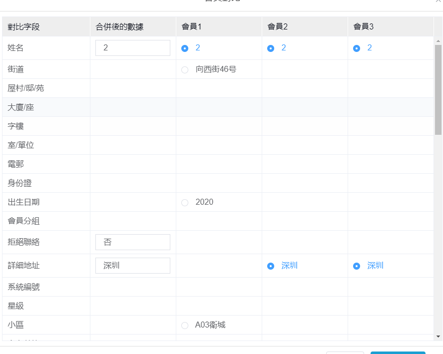

## 1.1 检测是否为数组
isArray() 方法用于判断一个对象是否为数组。如果对象是数组返回 true，否则返回 false。
```js
const judgeArr=(arr)=>{
    if(Array.isArray(arr)){
        return true;        
    }else{
        return false;
    }    
}
var arr = [];
var str = "[]";
console.log(judgeArr(arr))  //true
console.log(judgeArr(str))  //false
```
## 1.2 数组去重
### 终结版本
根据数组内的数据类型进行封装工具类。
```js
var arr = [
      {id:'1',name:"阿狸"},
      {id:'2',name:"艾莎"},
      {id:'2',name:"MT"},
      {id:'1',name:"MT"},
      {id:'1',name:"MT"},
  ];
var arr1 = [1,2,3,4,4,4,4,4,4,4,4,4];  
    /**
     * @description 数组去重，支持简单数组，对象数组，对象数组的key为数字或者字符串
     * @param arr  必选,要去重的数组。
     * @param obj_key 可选,要去重依据的对象key。
     */
     function unique(arr,obj_key){
         let newArr = [];
        if(arr[0].constructor === Number || arr[0].constructor === String){
            //简单数组 [1,2,3,3,4,4,5,5]
            newArr = Array.from(new Set(arr));
        }else if(arr[0].constructor === Object){
            let map = new Map();
            arr.forEach((item,index)=>{
                //map 取靠前的值,如果map不存在 key 才set
                if(!map.has(item[obj_key])){
                    console.log(index)
                    map.set(item[obj_key],item);
                }
                //==========================
                //map 取靠后的值，直接set 就可以了
                //map.set(item[obj_key],item);
            })
            newArr = [...map.values()];
        }
        return newArr;
     }
console.log(unique(arr,"id"))
console.log(unique(arr1))
```
### set简单去重
简单数组去重>>>>对象不会去重,因为两个对象是引用类型，不会相等，可以把对象json字符串化
```js
//利用set将[1,2,2,3,5,4,5]转化成set数据,
var changeReArr=(arr)=>{
  //利用array from将set转化成数组类型
  return Array.from(new Set(arr));
  // 或者利用...扩展运算符将set中的值遍历出来重新定义一个数组,...是利用for...of遍历的
  //return [...new Set(arr)];
}
var arr = [1,2,2,3,5,4,5];
var arr1 = [{name:'1',age:"23"},{name:"1",age:"23"}];
console.log(changeReArr(arr));//[1, 2, 3, 5, 4]
console.log(changeReArr(arr1));//[{name:'1',age:"23"},{name:"1",age:"23"}]
```
### set对象去重
思路：对象去重,可以把对象json字符串化   
__适用对象，数组内的对象完全一样__  
```js
var changeReArr=(arr)=>{
  //利用array from将set转化成数组类型
  //return Array.from(new Set(arr.map(v => JSON.stringify(v))))
          //.map(v=>JSON.parse(v));  
  // 或者利用...扩展运算符将set中的值遍历出来重新定义一个数组,...是利用for...of遍历的
  return [...new Set(arr.map(v => JSON.stringify(v)))].map(v=>JSON.parse(v));
}
var arr1 = [{name:"1",age:"23"},{name:"1",age:"23"}];
console.log(changeReArr(arr1));//[{name:"1",age:"23"}]
```
### map 对象属性去重
思路>根据数组中对象某一个属性去重,map 的数据结构特点：key 不会重复，如果重复，set 时候 value 会替换掉.  
__适用对象，需要根据数组内的对象的某一个属性去重，但两个对象中的值不一定完全相等__  
```js
var arr = [
    {id:'1',name:"阿狸"},
    {id:'2',name:"艾莎"},
    {id:'2',name:"MT"},
    {id:'1',name:"MT"},
]

/**
 * @description 根据数组对象中的key去重,返回去重后的数组
 * @param arr    要去重的数组
 * @param obj_key 要去重依据的对象key
 * @constructor  wushaopeng
 */
function Duplicate_removal_byMap(arr,obj_key) {
    let map = new Map();
    arr.forEach((item,index)=>{
        //map 取靠前的值,如果map不存在 key 才set
        if(!map.has(item[obj_key])){
            console.log(index)
            map.set(item[obj_key],item);
        }
        //==========================
        //map 取靠后的值，直接set 就可以了
        //map.set(item[obj_key],item);
    })
    console.log(map);
    return [...map.values()];
}
let newArr = Duplicate_removal_byMap(arr,"id");
console.log(newArr)// [{id:'1',name:"阿狸"},{id:'2',name:"艾莎"},]
```

## 1.3数组排序

### sort()
sort() 方法用原地算法对数组的元素进行排序，并返回数组。默认排序顺序是在将元素转换为字符串，然后比较它们的UTF-16代码单元值序列时构建的;
语法:  arrayObject.sort(sortby)
- sortby(firstEl,secondEl)	可选。规定排序顺序。必须是函数。
  - firstEl：第一个用于比较的元素。
  - secondEl：第二个用于比较的元素。   

返回值: 对数组的引用。请注意，数组在原数组上进行排序，不生成副本。
:::warning
1,如果没有对其进行排序的函数，则默认按照字符编码的顺序，数字不会排序。
坑坑坑坑坑2,改变的是 数组的引用。如要复制数组，可采用扩展运算符
    let arr = [1, 2];
    arr1 = [...arr];//[1, 2]
:::
### 简单排序
```js
var arr = ["f","h","e","a"];
var newArr = arr.sort();
console.log(newArr);//["a", "e", "f", "h"]
console.log(arr) //["a", "e", "f", "h"]
newArr.push("or");
console.log(newArr);//["a", "e", "f", "h", "or"]
console.log(arr);//["a", "e", "f", "h", "or"]
```
### 数字排序
```js
var arr = ["10","2","45","66"];
function sortNumber(a,b){
  return a - b;
}
arr.sort(sortNumber);
//或者
arr.sort((a,b)=>a-b)
console.log(arr) //["2", "10", "45", "66"]
```

### 对象属性（数字）排序
```js
var arr = [{age:"12",name:"tom"},{age:"11",name:"angular"},{age:"18",name:"xiexie"}];
function sortByNumber(key){
  return (a,b)=>{
      return a[key] - b[key];
  }
}
//根据 属性（数字排序）
arr.sort(sortByNumber("age"));
//或者
arr.sort((a, b)=>{
  return (a.age - b.age)
})
console.log(arr)
 // [{age:"11",name:"angular"},{age:"12",name:"tom"},{age:"18",name:"xiexie"},];
```

### 对象属性（字符）排序
对 首字母 进行 abcdef...排序
```js
var arr = [{age:"12",name:"tom"},{age:"11",name:"Yngular"},{age:"18",name:"xiexie"}];
//根据 属性（字符排序）
function sortByStr(key){
  return (a,b)=>{
    var nameA = a[key].toUpperCase(); // 转化为大写 lowercase(小写)
    var nameB = b[key].toUpperCase(); // 转化为大写 lowercase（小写）
    if (nameA < nameB) {
        return -1;
    }
    if (nameA > nameB) {
     return 1;
    }
    return 0;
  }
}
arr.sort(sortByStr("name"));
//或者
arr.sort((a, b)=>{
  var nameA = a.name.toUpperCase(); // 转化为大写
  var nameB = b.name.toUpperCase(); // 转化为大写
  if (nameA < nameB) {
      return -1;
  }
  if (nameA > nameB) {
   return 1;
  }
  return 0;
})
console.log(arr)  
// [{age:"12",name:"angular"},{age:"18",name:"xiexie"},{age:"11",name:"Yngular"}];
```

## 1.4 特殊数组处理

### table对象对比



```js
//正常表格数据形式
var tableDemo = [
    { id:'0011',name:'蔡雅健',music:'空白格', },
    { id:'0012',name:'群星',music:'可惜不是你'},
    { id:'0013',name:'花粥',music:'一腔诗意喂了狗'},
    { id:'0014',name:'花粥',music:'隔壁王大仙'},
    { id:'0015',name:'花粥',music:'烽火连三月'},
];
//字段与字段说明对应关系
var fieldArr = [
    {
        field:'id',
        fieldExplain:'id主键',
    },
    {
        field:'name',
        fieldExplain:'姓名',
    },
    {
        field:'music',
        fieldExplain:'作品',
    },
];
//处理开始
var tableResult = [...fieldArr];
tableResult.forEach(item=>{
    tableDemo.map((data,index)=>{
        item[`fieldValue${index+1}`] = data[item.field]
    })
})
console.log(tableResult)
//结果示例
var tableResultDemo =
    [
        {
            field: 'id',
            fieldExplain: 'id主键',
            fieldValue1: '0011',
            fieldValue2: '0012',
            fieldValue3: '0013',
            fieldValue4: '0014',
            fieldValue5: '0015'
        },
        {
            field: 'name',
            fieldExplain: '姓名',
            fieldValue1: '蔡雅健',
            fieldValue2: '群星',
            fieldValue3: '花粥',
            fieldValue4: '花粥',
            fieldValue5: '花粥'
        },
        {
            field: 'music',
            fieldExplain: '作品',
            fieldValue1: '空白格',
            fieldValue2: '可惜不是你',
            fieldValue3: '一腔诗意喂了狗',
            fieldValue4: '隔壁王大仙',
            fieldValue5: '烽火连三月'
        }
    ]
```

