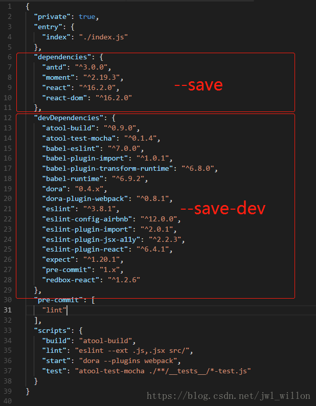

## npm install
**npm install --save 、--save-dev 、-D、-S 的区别与NODE_ENV的配置**
 下列用 <==> 表示等价于

 ```sh
 #使用 `npm i` 安装package.json里的依赖时，两部分的包都会pull下来
npm i <==> npm install

#项目（运行时、发布到生产环境时）依赖；例：antd , element,react...
npm i --save <packname>  <==> -S

#工程构建（开发时、“打包”时）依赖 ；例：xxx-cli , less-loader , babel-loader...
npm i --save-dev <packname>  <==> -D

#仅会拉取dependencies中的依赖
npm i --prod <=> npm i --production

npm run start <=> npm start # 对应"scripts"里的"start"命令
 ```

对应关系如下（至于我们啥时候用--save、啥时候用--save-dev 感觉是个规范问题，用反了项目一样可以跑起来（对于安装依赖正确时），但会给其他看你项目的人带来误解、可能会导致一些bug的出现，还有一些配置的错乱等）



## process.env.NODE_ENV的应用

### vue-cli 3中

根目录下配置文件

`.env.development` 模式用于serve，开发环境，就是开始环境的时候会引用这个文件里面的配置

 .env.development文件对应开发环境，对应命令： vue-cli-service serve

```sh
# just a flag,获取process.env.ENV
ENV = 'development'

# base api，获取 process.env.VUE_APP_BASE_API
VUE_APP_BASE_API = 'http://192.168.1.252:8182'

# vue-cli 使用 VUE_CLI_BABEL_TRANSPILE_MODULES 作为环境变量,
# 来控制 babel-plugin-dynamic-import-node 插件是否生效.
# 这个插件只做一件事情把所有的 import() 变成 require().
# 通过这种配置，当你有大量的页面时可以显著提高热更新的速度,
# Detail:  https://github.com/vuejs/vue-cli/blob/dev/packages/@vue/babel-preset-app/index.js

VUE_CLI_BABEL_TRANSPILE_MODULES = true

```


.env.production模式用于build，线上环境。 对应命令：vue-cli-service build

`.env.production`文件对应生产环境

```sh
just a flag
ENV = 'production'

# base api
VUE_APP_BASE_API = '/prod-api'

```

.env.staging 文件对应测试环境。 对应命令：vue-cli-service build --mode staging

```sh
NODE_ENV = production

# just a flag
ENV = 'staging'

# base api
VUE_APP_BASE_API = '/stage-api'
```

